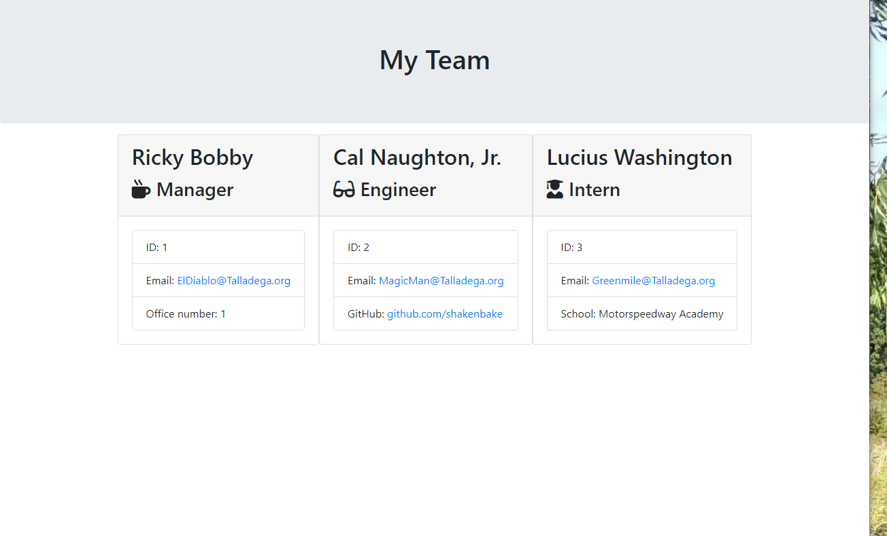

# Team Profile Generator

  ## Description
  This is a Team Profile generator app built using inquirer that uses a render to function to build an HTML page with your team members on cards for your viewing pleasure.

  ## Images

  
  * https://youtu.be/TTfChJFoZKg

  ## Installation
  To install this use a git clone to create a copy of the code on to your local machine and run an npm init on your bash, prompt, or whatever cli you might use on your machine to make use of this app

  ## Usage
  You can use this app to track new employees along with their emails, github profiles etc..

  ### Tests
  To test this code you can do and npm for jest and run a node test to make sure it is functioning properly
  
  #### Author
  - Joseph Flygare